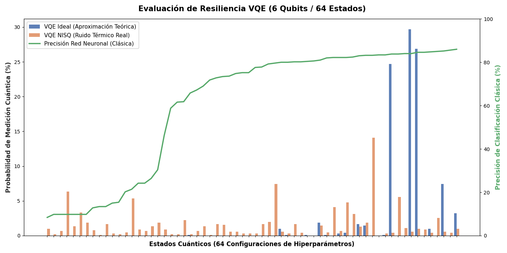

# 🧬 VQE (Pauli): Ansatz Hardware-Efficient y Resiliencia NISQ

Esta carpeta contiene la implementación del algoritmo variacional **VQE (Variational Quantum Eigensolver)** aplicado a la Optimización de Hiperparámetros (HPO). A diferencia de la búsqueda exacta de Grover, este enfoque modela el problema como la minimización de la energía de un sistema físico.

## 🎯 Enfoque Metodológico
Para adaptar el problema clásico al entorno cuántico, se han mapeado las 64 precisiones extraídas de la red neuronal clásica (PyTorch) a un **Hamiltoniano de Ising (Operadores Pauli Z)**. El objetivo del circuito es encontrar el estado fundamental (*ground state*) de este observable, que corresponde a la configuración con mayor precisión clásica.

## ⚙️ Pipeline de Ejecución

1. **`01_benchmark_clasico.py`**: Evaluación base de los 64 hiperparámetros.
2. **`02_vqe_ideal.py`**: Entrenamiento híbrido cuántico-clásico usando el optimizador `COBYLA`. Se utiliza un *Ansatz* `RealAmplitudes` de 2 repeticiones.
3. **`03_vqe_ruido.py`**: Prueba de estrés en hardware simulado con ruido térmico y de despolarización (modelo de IBM).
4. **`04_analisis_metricas.py`**: Demostración empírica de la resiliencia algorítmica. El análisis topológico revela que el *Ansatz Hardware-Efficient* se transpila en apenas **10 puertas entrelazadas (CX)**, logrando una supervivencia teórica superior al **81%**.
5. **`05_graficas_vqe.py`**: Visualización comparativa que demuestra cómo VQE logra evadir el colapso térmico y destacar las mejores soluciones por encima del ruido de fondo.

## 📊 Artefactos y Conclusiones
* En el archivo `datos_hpo.json` y la gráfica generada se demuestra que **VQE es el algoritmo superior para la era NISQ** en problemas de HPO discretizados, logrando un equilibrio sin precedentes entre profundidad de circuito y capacidad de optimización heurística.

## 📈 Resultados Visuales

La siguiente gráfica demuestra la superioridad de VQE en la era NISQ. Gracias a la baja profundidad de su circuito (solo 10 puertas CX), la señal sobrevive al ruido térmico (naranja), logrando identificar configuraciones de hiperparámetros con precisiones superiores al 83%.

